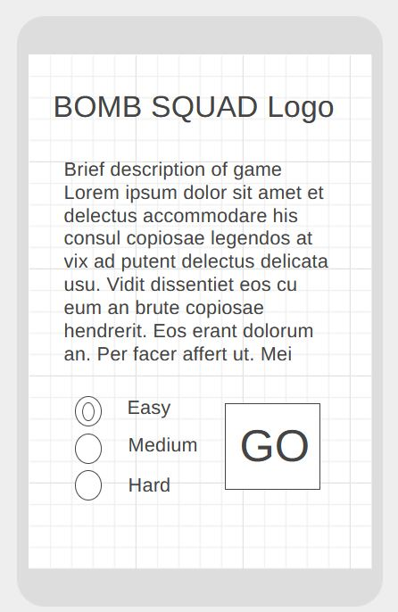
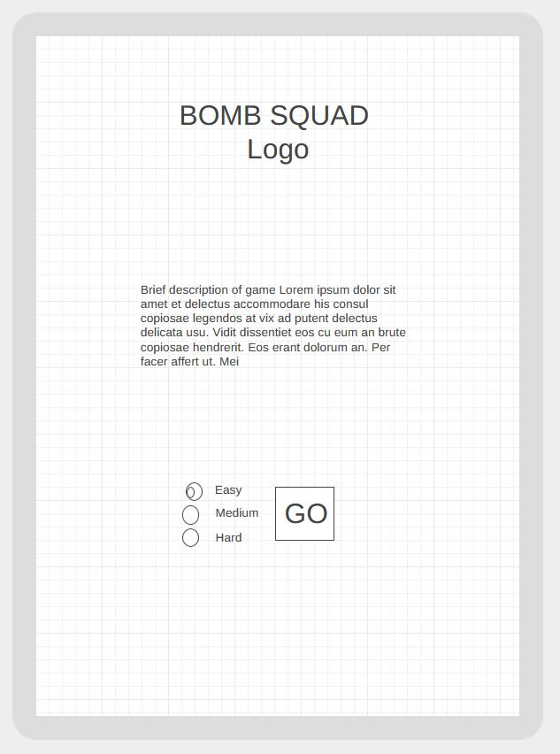
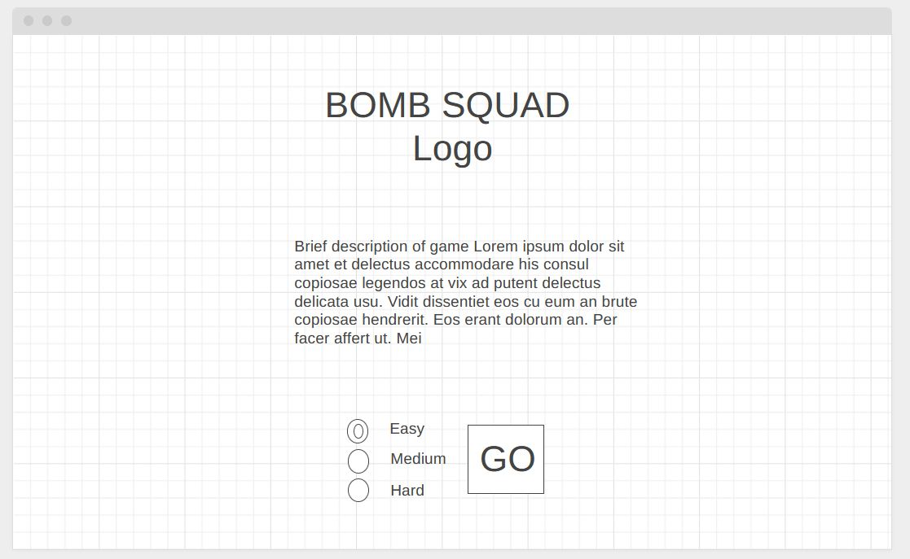
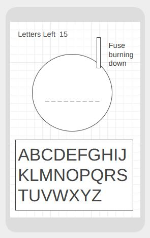
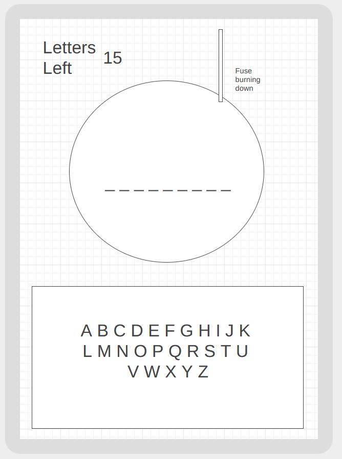
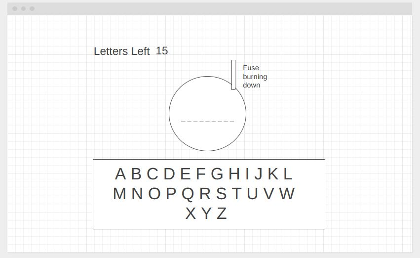
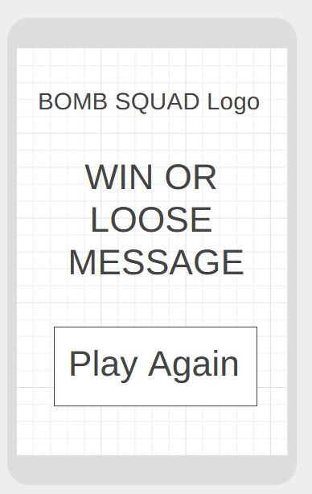
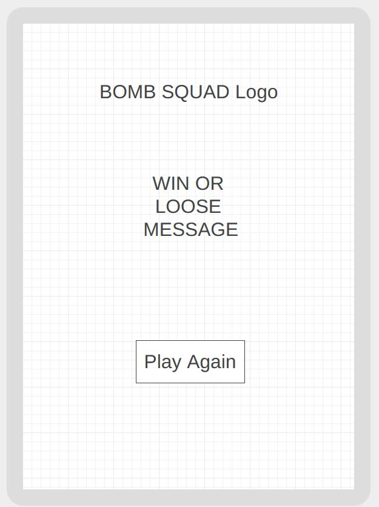
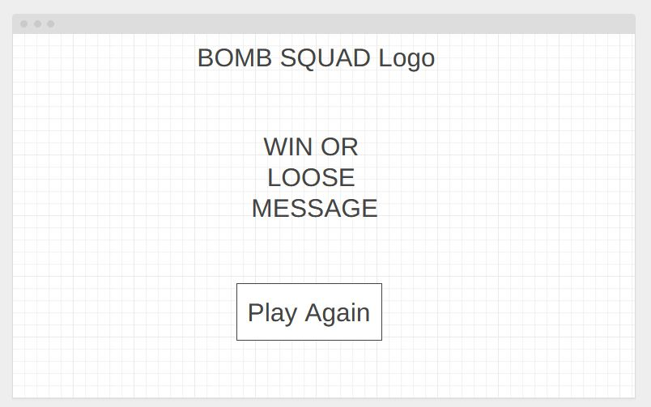

# Bomb Squad
## js_game_leah_ci_project2
## Javascript game for Code Institute Milestone Project 2

## UX
### Project Goal
The primary goad is to create an educational game to allow people to learn new words.

#### Tagret Audience

* Anyone looking to pass the time with a simple game and maybe learn a new word or two.

#### User goals
* Win the game
* Maybe have a litle fun
* Learn a new word or two
* Try and get a high score
#### Required sections
* Welcome, explanation, select difficulty
* Main game screen
* Win / Loose screen


## User stories

* I am a user looking to learn a new word.
* I am a user just looking to fill 5 minutes..
* I am a parent looking to keep my child occupied for a few minutes..

## Design choices

My design choices are to make an exciting looking game that can be played on all devices from phones to desktop PC within a browser. The user will be required to guess a randomly selected word by pressing keys on the keyboard or buttons on screen. There will be a limit to the number of guesses, if this is exceeded the bomb will explode. If the user guesses all the letters of the word the bomb is disarmed and the player wins.

## Wireframe
I have created wireframe views of the three pages that the site will have based on my required sections. I used wireframe.cc to complete this task.

### Welcome Screen

##### Mobile

https://wireframe.cc/wQ6r6B
---
##### Tablet

https://wireframe.cc/SafSfs

---
##### Laptop / Desktop

https://wireframe.cc/UTqCHl
### Main Game Screen

##### Mobile

https://wireframe.cc/qbmGOd

---
##### Tablet

https://wireframe.cc/doqUVW
---
##### laptop / Desktop

https://wireframe.cc/xWuU9l
---

### Win / Loose Conclusion Screen

##### Mobile

https://wireframe.cc/0Rviu0
---
##### Tablet

https://wireframe.cc/QImuPM

---
##### Laptop

https://wireframe.cc/TLwtMm

---

## Logical Code Outline

### Requirements
* A source of words for each difficulty level, intenal dictionary array and / or external API.
* Variables to check if entered letters match the code word, number of guesses, turns remaining, difficulty level.
* Link to external sites to describe the meaning of the word if the user wants to find out.

### High Level Program flow
1. User selects difficulty level
2. User clicks / touches GO
3. A random word is selected based on the difficulty level
4. The blank word display is set to match the length of the selected word
5. User enters a character by touching the screen or using the keyboard
6. The entered character is validated against the dictionary to check it is a suitable, Input validation
7. If the letter is in the word it is entered into the correct place in the display
8. On screen feedback, the keyboard highlights letters red or green as they are chosen
9. If the word is guessed correctly before they run out of time they win
10. If the user runs out of turns the bomb explodes and the user loses
11. Win or Loose is displayed with the option to try again.

## Testing

### When selecting Hard difficulty occasionally the button does not work.
Upon checking the console the following error was displayed 'undefined script.js:45:13'
Line 45 was attempting to display the word and the variable was undefined but not all the time.
The error was found in the following code:
```javascript
switch (difficulty) {
        case 'easy':
            word = dictEasy[Math.floor(Math.random() * dictEasy.length)];
            attemptsRemaining = 20;
            break;
        case 'medium':
            word = dictMedium[Math.floor(Math.random() * dictEasy.length)]; //dictEasy should be dictMedium
            attemptsRemaining = 15;
            break;
        case 'hard':
            word = dictHard[Math.floor(Math.random() * dictEasy.length)]; //dictEasy should be dictHard
            attemptsRemaining = 15;
            break;
    }
```
The medium and hard case were using the length of the easy dictionary. Correcting the code to use the correct dictionary for length resolved the issue.

```javascript
switch (difficulty) {
        case 'easy':
            word = dictEasy[Math.floor(Math.random() * dictEasy.length)];
            attemptsRemaining = 20;
            break;
        case 'medium':
            word = dictMedium[Math.floor(Math.random() * dictMedium.length)];
            attemptsRemaining = 15;
            break;
        case 'hard':
            word = dictHard[Math.floor(Math.random() * dictHard.length)];
            attemptsRemaining = 15;
            break;
    }
```

### GitHub issue 1 When win / lose the win lose message is not visible on smaller screens.
Resolved by hiding the keyboard on the conclusion screen.
```javascript
$('#keyboard').hide();
```

### Github issue 2 When starting a new game the attempts remaining display retains the previous value until a key is pressed.
Added the following just after difficulty selection.
```javascript
$('#guesses-remaining').text('Attempts remaining = ' + attemptsRemaining);
```


